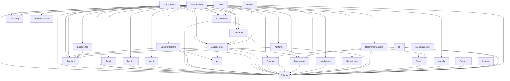

# Nova Sphere Dependency Graph

## Domain Interactions

```mermaid
flowchart TD
  Presentation --> Infrastructure(Prisma)
  Presentation --> Customer
  Presentation --> Engagement
  Presentation --> Marketplace
  Presentation --> Foundation
  Presentation --> Commerce
  Presentation --> Realtime
  Presentation --> Auction
  Presentation --> Intelligence
  Presentation --> Finance
  Presentation --> CommerceCore
  Presentation --> Audit
  Presentation --> Recommendations
  Presentation --> Platform
  Presentation --> Infrastructure(Stripe)
  Presentation --> Admin
  Presentation --> Experience
  Presentation --> signals
  Presentation --> discovery
  Presentation --> personalization
  components --> Commerce
  components --> Customer
  components --> Realtime
  components --> Engagement
  components --> Infrastructure(PostHog)
  Admin --> Infrastructure(Prisma)
  Auction --> Infrastructure(Prisma)
  Audit --> Infrastructure(Prisma)
  Commerce --> Infrastructure(Prisma)
  Commerce --> Customer
  CommerceCore --> Realtime
  CommerceCore --> Infrastructure(Prisma)
  CommerceCore --> Infrastructure(Stripe)
  CommerceCore --> AI
  Customer --> Infrastructure(Prisma)
  Customer --> Engagement
  Engagement --> Infrastructure(Prisma)
  Engagement --> AI
  Engagement --> Realtime
  Engagement --> Foundation
  Experience --> Realtime
  Finance --> Infrastructure(Prisma)
  Finance --> Infrastructure(Stripe)
  Foundation --> Infrastructure(Prisma)
  Intelligence --> Infrastructure(Prisma)
  Marketplace --> Infrastructure(Prisma)
  Merchandising --> Search
  Platform --> Infrastructure(Prisma)
  Platform --> Foundation
  Platform --> Realtime
  Recommendations --> Infrastructure(Prisma)
  Recommendations --> Search
  Recommendations --> Foundation
  Search --> Infrastructure(Prisma)
  signals --> Infrastructure(PostHog)
  Support --> Infrastructure(Prisma)
  hooks --> Commerce
  inngest --> Infrastructure(PostHog)
  lib --> Infrastructure(Prisma)
  lib --> Finance
  lib --> Infrastructure(Stripe)
  shared --> Infrastructure(Prisma)
  shared --> Commerce
  shared --> Engagement
  shared --> discovery
  shared --> Foundation
```
