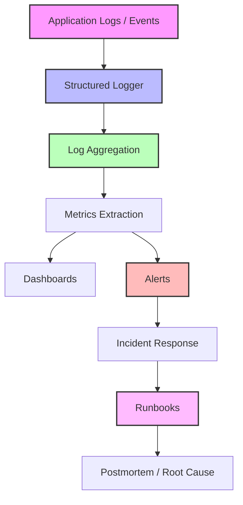

# Observability Architecture

This document defines the blueprint for observability across the Nova Sphere marketplace. It serves as the standard path from application execution to incident resolution. Every domain service must adhere to this architecture.

## The Observability Pipeline



## 1. Distributed Tracing

A single request often spans multiple boundaries. We implement distributed tracing by propagating a `Trace ID` across all boundaries:
```
Browser → Next.js → Order Engine → Payment Engine → Stripe → Webhook → Outbox → Notification
```
Every log entry and metric must carry this Trace ID, ensuring that during an incident, we can reconstruct the exact sequence of events for a specific user request without ambiguity.

## 2. Application Logs

All domain logic must emit context-rich logs. A standard log entry must include:
- `trace_id`: Distributed tracing identifier for correlation across boundaries.
- `user_id`: The actor performing the action.
- `domain`: The bounded context (e.g., `OrderEngine`, `InventoryEngine`).
- `event_type`: The specific action (e.g., `OrderPlaced`, `StockReserved`).

## 2. Structured Logger

We do not use `console.log`. All outputs must be parsed through a JSON structured logger (e.g., Pino or Winston) configured to append the environment context automatically.

## 3. Log Aggregation

Logs are shipped asynchronously (to prevent blocking the main thread) to our log aggregation tool (e.g., Datadog, ELK, or CloudWatch).

## 4. Metrics

Metrics are derived from logs and direct telemetry:
- **Counters**: Absolute numbers (e.g., total orders).
- **Gauges**: Point-in-time values (e.g., current active WebSockets).
- **Histograms**: Distributions (e.g., API Latency P50, P90, P99).

## 5. Dashboards

Dashboards visualize the metrics following the **Golden Signals**:
- **Latency**: The time it takes to service a request.
- **Traffic**: A measure of how much demand is being placed on the system.
- **Errors**: The rate of requests that fail.
- **Saturation**: How "full" the most constrained resources are.

## 6. Alerts

Alerts are configured on metric thresholds tied strictly to our SLO Error Budgets. We do not alert on symptom metrics (e.g., CPU high) unless they threaten an SLO (e.g., Checkout Latency > 2s).

## 7. Incident Response

Alerts page the on-call engineer via an escalation policy (e.g., PagerDuty). The alert payload *must* contain a link to the relevant Runbook.

## 8. Runbooks

Runbooks provide deterministic, step-by-step procedures to mitigate incidents and restore service within the SLA.

## 9. Postmortems

Once service is restored, the team conducts a blameless postmortem to identify the root cause and implement preventative actions, feeding back into the architecture.
