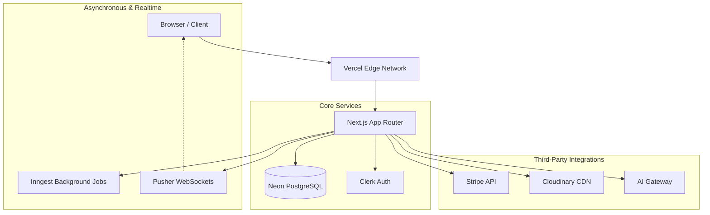
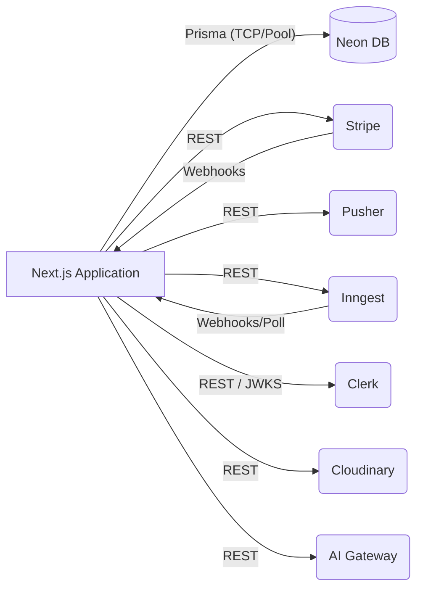
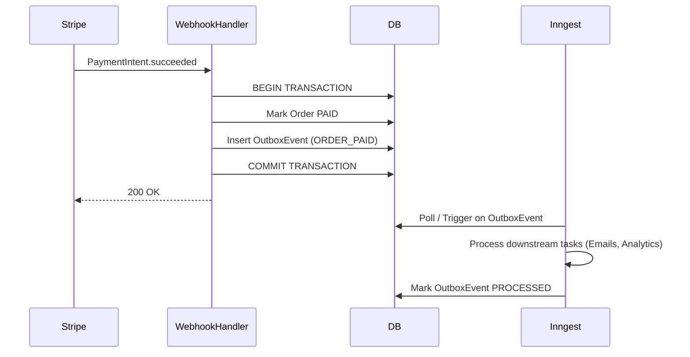
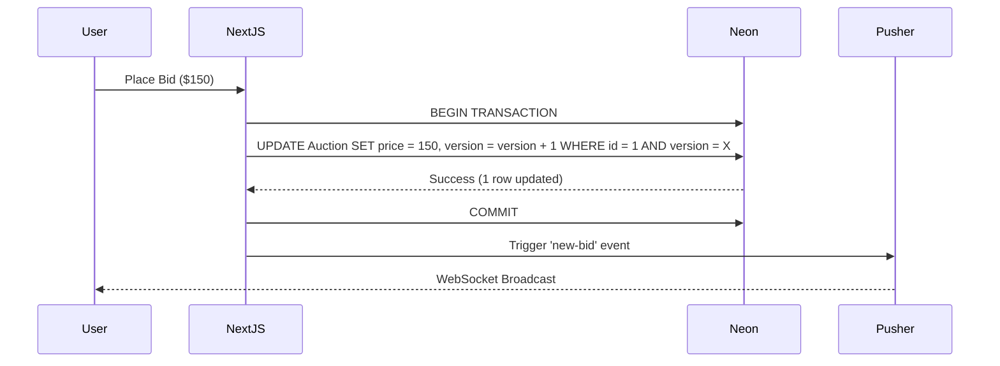

# Nova Sphere V3 System Architecture

This document serves as the canonical architectural reference for Nova Sphere V3, providing an overview of system boundaries, dependencies, and operational flows.

## 1. Overall System Architecture

Nova Sphere is a modern, serverless e-commerce and auction marketplace built on **Next.js (App Router)**. It leverages a distributed, managed infrastructure model to achieve high scalability and resilience without maintaining physical servers or long-running VMs.

## 2. Domain Boundaries

Nova Sphere is structured around distinct business domains to enforce separation of concerns:

- **CommerceCore**: Manages orders, checkout flows, and cart merging. Includes the PaymentEngine for idempotency and the Transactional Outbox pattern.
- **Platform**: Handles workflow orchestration (via sagas), AI integrations, and cross-cutting concerns like the Launch Control Center / Operations Console.
- **Auctions**: Dedicated bounded context for high-throughput, realtime bidding via Pusher, using Optimistic Concurrency Control (OCC) to prevent race conditions.
- **Identity/Auth**: Offloaded to Clerk but managed locally via proxy models (e.g., local User records mapped to Clerk IDs).

## 3. Service Dependency Diagram

## 4. Event Flows

### Stripe Payment & Transactional Outbox
We utilize the Transactional Outbox pattern to guarantee eventual consistency between external systems (Stripe) and our database.

### Pusher Realtime Bidding
Bidding requires extremely low latency. Bids are optimistically written using `Auction.version` locking to prevent races, then broadcast via Pusher.

## 5. Database Overview

Nova Sphere uses **Neon (Serverless PostgreSQL)**.
- **ORM**: Prisma.
- **Concurrency**: Optimistic Concurrency Control (OCC) heavily utilized in high-write areas (Auctions).
- **Transactions**: Strict ACID boundaries used for multi-table writes via `prisma.$transaction`.
- **Migrations**: Managed via Prisma Migrate, synced during CI/CD.

## 6. Authentication Flow

Authentication is managed by **Clerk**.
- Edge middleware verifies session cookies/JWTs on protected routes.
- Webhooks from Clerk automatically sync user profiles to the local Neon database.
- Authorization (RBAC) is enforced at the application level via database roles (e.g., `ADMIN`, `VENDOR`, `CUSTOMER`).

## 7. Deployment Architecture

- **Host**: Vercel (Serverless / Edge).
- **Caching**: Next.js App Router Data Cache, Full Route Cache, and Router Cache. Strategic revalidation via tags/paths upon database mutations.
- **Environments**: Ephemeral Preview environments per PR, persistent Staging, and Production.

## 8. Operational Monitoring Architecture

The **Operations Console** (`/admin/health`) provides Level 3 Observability using a strict **Provider Abstraction** pattern.

- Telemetry is gathered explicitly from subsystem SDKs or APIs.
- Systems are marked `CONNECTED`, `UNAVAILABLE`, or `NOT_CONFIGURED`.
- Fallbacks and degraded states are monitored here (e.g., tracking Inngest Dead Letter Queues, Stripe API Latency, AI Budget Burn Rates).
- Incident playbooks and emergency controls (feature flags, maintenance modes) are integrated directly into the console.
